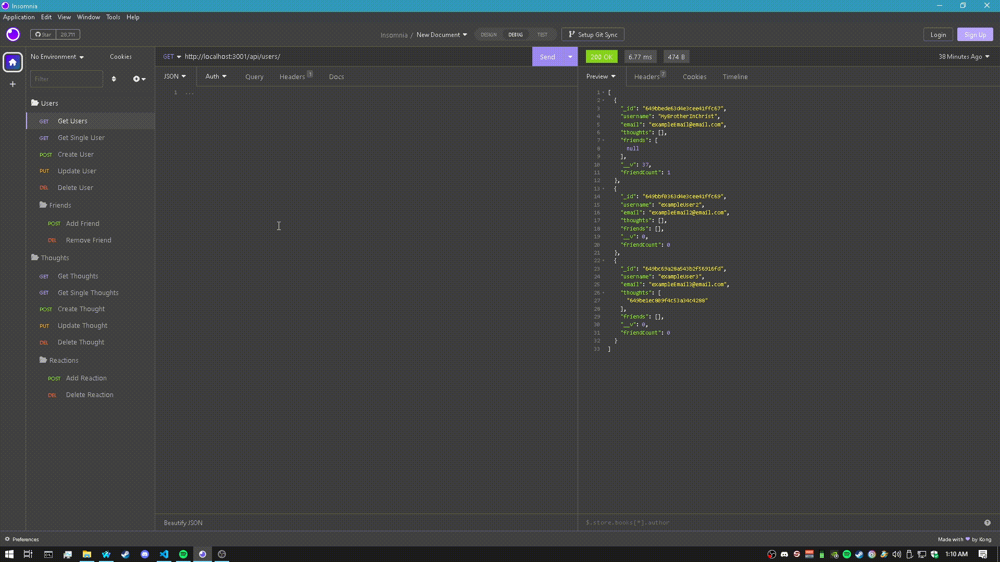

# example-social-network-api

## Table of Contents

- [Description](#Description)
- [Installation](#Installation)
- [Usage](#Usage)
- [Test Instructions](#Test_Instructions)
- [License](#License)
- [Questions?](#Questions?)

## Description

My very own scrumptious example social-network database terminal application. Made using the criteria from Module 18 of my edX Web Development bootcamp. I made it as compact as possible within my tight time limit I had.
The application allows users to build, access, and modify an example database of users, thoughts (posts), reactions, and their associated data using the basic CRUD method. Used Mongoose/MongoDB instead of MySQL. 

## Installation

Download the project via your preferred means, then drag it into it's own directory on your machine.

## Usage
 
0. Input and enter the command "npm i", followed by "node run start" to run the program.
1. Interface with the now booted database via Insomnia, or an application like it.
2. For assistance, look to the embedded demonstration gif.

## Demonstration

## License

This project is protected under the MIT License.

## Questions?

Reach out to me either on [GitHub](https://github.com/NoahJRalph) or by [Email](mailto:NoahJRalph@gmail.com).
